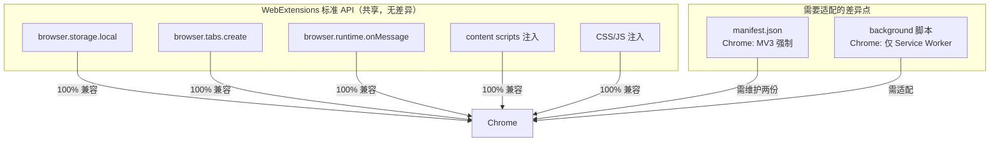

# childtype - 项目文档

## 1. 项目概述

childtype 是一款面向 8-12 岁小朋友的 **Firefox / Chrome** 浏览器插件，帮助孩子们学习正确的键盘指法、提升打字速度，并通过游戏化方式激励持续练习。项目旨在让小朋友在趣味中掌握打字技能，同时让家长和教师能直观见证打字能力的成长轨迹。

## 2. 目标用户

| 维度 | 描述 |
|------|------|
| 年龄 | 8-12 岁儿童（小学中低年级） |
| 使用场景 | 家庭/学校电脑前，浏览器内使用 |
| 核心诉求 | 学会正确指法、提升打字速度、保持练习兴趣 |
| 次要诉求 | 家长能追踪学习进度和成果 |

## 3. 项目定位

### 3.1 解决的问题
- 小朋友自学打字缺乏正确指法指导，容易养成不良习惯
- 传统打字练习工具枯燥，难以吸引儿童持续使用
- 缺乏可视化反馈，无法感知打字能力的进步

### 3.2 产品价值
- **指法教学**：通过虚拟键盘实时高亮，教会孩子每个键的正确手指
- **速度练习**：提供多种练习模式，科学提升打字速度和准确率
- **游戏激励**：成就、星星、等级系统让练习变得有趣
- **成长追踪**：可视化展示学习进度和成绩变化

## 4. 功能规划

### 4.1 核心功能

#### 指法教学模块
- 虚拟 QWERTY 键盘可视化，按手指区域分色标注
- 分阶段课程（6 个 Level）：
  - **Level 1**：左手 Home Row（A S D F）
  - **Level 2**：右手 Home Row（J K L ;）
  - **Level 3**：左手上下行（Q W E R T + Z X C V B）
  - **Level 4**：右手上下行（Y U I O P + N M , . /）
  - **Level 5**：全键盘综合练习
  - **Level 6**：数字和符号键
- 每级包含 3-5 篇练习文章，由简到繁
- 指法动画演示（手指应放置位置、按键轨迹）

#### 打字速度练习模块
- **模式选择**：
  - 自由模式：选择文章自由练习
  - 计时模式：15秒 / 30秒 / 60秒限时挑战
  - 闯关模式：逐字 → 逐词 → 逐句过关
- **实时反馈**：
  - 正确率百分比
  - WPM（Words Per Minute）实时显示
  - 错误字符高亮标记
- **历史成绩**：每次练习后保存记录

#### 游戏化模块
- **星星评级**：每次练习获得 1-3 颗星
- **成就系统**：
  - "第一次打字" — 完成首次练习
  - "100 WPM 达人" — 达到 100 WPM
  - "完美无瑕" — 100% 准确率
  - "每日练习者" — 连续 7 天练习
  - 更多成就持续扩展
- **等级系统**：新手 → 打字学徒 → 打字能手 → 打字达人 → 打字大师
- **进度可视化**：进度条、折线图展示成长轨迹

### 4.2 辅助功能

#### 数据存储
- 使用 `browser.storage.local` 存储：
  - 学习进度（已完成课程）
  - 历史成绩
  - 成就解锁状态
  - 用户偏好（主题、字体大小）

#### 用户偏好
- 字体大小调节
- 主题切换（明亮/暗色）
- 提示音效开关

### 4.3 未来规划（后续迭代）
- 多语言支持（中/英）
- 家长控制面板（查看孩子进度）
- 云端同步（可选）
- 自定义文章导入
- 排行榜（匿名）
- 移动端适配（PWA 模式）

## 5. 技术方案

### 5.1 技术栈

| 技术 | 用途 | 版本 |
|------|------|------|
| TypeScript | 类型安全的开发语言 | ^5.3 |
| WebExtensions API | 浏览器扩展标准接口 | Firefox 57+ / Chrome 88+ |
| Web Components | 可复用 UI 组件（键盘等） | — |
| Webpack | 模块打包和构建 | ^5 |
| LocalStorage / browser.storage | 数据存储 | — |

### 5.2 项目结构

```
childtype/
├── manifest-firefox.json      # Firefox 扩展清单 (MV2/MV3)
├── manifest-chrome.json       # Chrome 扩展清单 (MV3)
├── package.json               # 依赖和脚本
├── tsconfig.json              # TypeScript 配置
├── webpack.config.ts          # 构建配置
├── PROJECT.md                 # 项目文档（本文件）
├── README.md                  # 项目简介
│
├── src/
│   ├── shared/                # 完全通用的代码（共享）
│   │   ├── components/        # UI 组件
│   │   │   ├── keyboard.ts        # 虚拟键盘组件
│   │   │   ├── typing-area.ts     # 打字输入区域
│   │   │   ├── stats-panel.ts     # 统计面板
│   │   │   └── progress-tracker.ts # 进度追踪
│   │   ├── data/              # 数据层
│   │   │   ├── lessons.ts         # 课程数据
│   │   │   └── words.ts           # 单词/文章库
│   │   ├── store/             # 状态管理
│   │   │   └── progress.ts        # 进度存储
│   │   └── lib/               # 共享工具
│   │       ├── types.ts               # 类型定义
│   │       ├── constants.ts           # 常量
│   │       └── utils.ts               # 工具函数
│   │
│   ├── pages/                 # 独立 Tab 练习页面（共享）
│   │   ├── index.html
│   │   ├── app.ts             # 主入口
│   │   └── styles/            # 样式
│   │       ├── main.css
│   │       └── keyboard.css
│   │
│   ├── browser-firefox/       # Firefox 特有适配
│   │   ├── manifest.json
│   │   └── background.ts
│   │
│   └── browser-chrome/        # Chrome 特有适配
│       ├── manifest.json
│       └── background.ts
│
└── build/
    ├── firefox/               # Firefox 构建输出
    │   ├── manifest.json
    │   └── ...
    └── chrome/                # Chrome 构建输出
        ├── manifest.json
        └── ...
```

### 5.3 跨浏览器兼容策略

Chrome 和 Firefox 均基于 **WebExtensions API**（W3C 标准），核心功能几乎完全共享，差异主要集中在两处：



**差异对比：**

| 方面 | Firefox | Chrome | 影响程度 |
|------|---------|--------|---------|
| manifest.json | MV2 或 MV3 | 必须 MV3 | 需维护两个文件 |
| background 脚本 | 可用普通脚本 | 仅 Service Worker | 少量改写 |
| browser.storage | 完全相同 | 基本相同 | 几乎无影响 |
| tabs API | 基本相同 | 基本相同 | 几乎无影响 |

**对本项目的影响：** childtype 核心功能全部在前端页面实现，background 脚本仅负责打开练习页面和简单路由，适配工作量约 **1-2 天**。

**开发策略：** 优先完成 Firefox 版本 → 验证核心功能 → 打包 Chrome 版本只需修改 manifest.json + background 脚本几行代码。

### 5.4 关键技术点

#### 键盘事件处理
- 监听 `keydown` 事件（而非 `input` 事件），捕获每个物理按键
- 预加载练习文本，逐字符对比验证
- 支持退格键处理

#### 性能优化
- 使用 `requestAnimationFrame` 渲染动画
- 虚拟键盘使用 SVG 绘制（减少 DOM 重排）
- 课程数据预加载，避免运行时动态请求

#### 数据存储策略
```typescript
// 数据结构示例
interface UserProgress {
  currentLevel: number;       // 当前练习等级
  completedLevels: number[];  // 已完成的等级
  lessonsCompleted: string[]; // 已完成的课程ID
  totalStars: number;         // 累计获得的星星
  level: string;              // 当前等级称号
  stats: {
    bestWPM: number;          // 最佳WPM
    bestAccuracy: number;      // 最佳准确率
    totalPracticeTime: number; // 总练习时长（秒）
    practiceStreak: number;    // 连续练习天数
  };
  achievements: string[];      // 已解锁成就ID
  preferences: {
    fontSize: number;
    theme: 'light' | 'dark';
    soundEnabled: boolean;
  };
}
```

## 6. 开发计划

### Phase 1: 基础框架搭建（预计 2-3 天）
- [ ] 项目初始化（package.json, tsconfig.json, webpack.config.ts）
- [ ] 创建 manifest-firefox.json 和 manifest-chrome.json
- [ ] 搭建 Webpack 构建流程（支持双浏览器输出）
- [ ] 创建共享页面结构（HTML + CSS 骨架）
- [ ] 实现 Firefox background 脚本
- [ ] 实现 Chrome background 脚本
- [ ] 实现 content 脚本框架

### Phase 2: 指法教学模块（预计 4-5 天）
- [ ] 实现虚拟键盘 SVG 组件
- [ ] 实现键盘高亮和指法标注
- [ ] 实现打字输入区域
- [ ] 创建课程数据结构（lessons.ts + words.ts）
- [ ] 实现 Level 1 完整课程流程
- [ ] 实现 Level 2-3 课程

### Phase 3: 速度练习模块（预计 3-4 天）
- [ ] 实现计时器逻辑
- [ ] 实现 WPM 和准确率计算
- [ ] 实现自由模式和计时模式
- [ ] 实现闯关模式
- [ ] 实现成绩记录和展示

### Phase 4: 游戏化模块（预计 3-4 天）
- [ ] 实现成就系统
- [ ] 实现等级系统
- [ ] 实现星星评级
- [ ] 实现进度追踪和可视化
- [ ] 添加音效反馈（可选）

### Phase 5: 完善与测试（预计 2-3 天）
- [ ] 添加更多课程内容和文章
- [ ] UI/UX 细节优化
- [ ] 颜色主题切换
- [ ] 响应式布局
- [ ] 测试和调试
- [ ] 打包 Chrome 版本
- [ ] Firefox 扩展市场提交准备

**总预计工期：14-19 天**

## 7. 依赖列表

### 构建依赖
- `typescript` ^5.3 — TypeScript 编译器
- `webpack` ^5 — 模块打包
- `webpack-cli` ^5 — CLI 工具
- `html-webpack-plugin` ^5 — HTML 注入
- `copy-webpack-plugin` ^11 — 静态资源复制
- `css-loader` ^6 — CSS 处理
- `style-loader` ^3 — CSS 注入
- `ts-loader` ^9 — TypeScript 转译

### 开发依赖
- `@types/firefox-webext-browser` — Firefox API 类型定义
- `@types/chrome` — Chrome API 类型定义
- `@types/node` — Node.js 类型定义
- `prettier` — 代码格式化
- `eslint` — 代码检查

## 8. 已知约束

| 约束 | 说明 |
|------|------|
| 浏览器兼容 | 同时支持 Firefox 和 Chrome（通过双 manifest + 少量 background 适配） |
| 独立 Tab 页面 | 练习界面在独立标签页中运行，非弹出窗口 |
| 无后端 | 纯客户端实现，数据存储在本机浏览器中 |
| 儿童友好 | 内容需适合 8-12 岁，无复杂操作 |

## 9. 参考资源

| 资源 | 用途 |
|------|------|
| [Mozilla WebExtensions Docs](https://developer.mozilla.org/en-US/docs/Mozilla/Add-ons/WebExtensions) | Firefox 扩展开发官方文档 |
| [Chrome Extensions Docs](https://developer.chrome.com/docs/extensions) | Chrome 扩展开发官方文档 |
| [TypingClub](https://www.typingclub.com/) | 指法教学参考 |
| [TypeRacer](https://play.typeracer.com/) | 速度练习游戏化参考 |
| [10FastFingers](https://10fastfingers.com/) | 打字测试参考 |

## 10. 变更日志

### v0.1.0 (初始版本)
- 项目创建
- 项目文档初始化
- 架构设计完成（含跨浏览器兼容策略）
- 待开始开发
