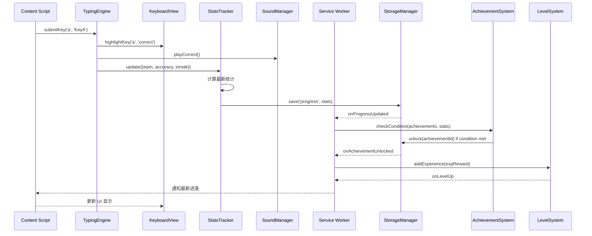

# 内部模块接口设计 / Internal Module Interface Design

本文档定义 ChildType 所有核心模块的公共接口，包含方法签名、参数、返回值、事件和依赖关系。

---

## 1. StorageManager — 存储管理

**运行环境：** Service Worker
**依赖：** `chrome.storage.sync` API

### 构造与实例化

```javascript
// 单例模式
const store = new StorageManager();
// 或
const store = StorageManager.getInstance();
```

### 公共方法

| 方法 | 参数 | 返回 | 说明 |
|------|------|------|------|
| `get(key)` | `string` 存储键路径 | `Promise<any>` | 读取指定 key 的数据，支持嵌套路径如 `progress.modeStats` |
| `set(key, value)` | `string`, `any` | `Promise<void>` | 写入指定 key 的数据 |
| `update(key, updaterFn)` | `string`, `Function` | `Promise<void>` | 读取 → 修改 → 写入，保证原子性（如递增经验值） |
| `remove(key)` | `string` | `Promise<void>` | 删除指定 key |
| `clear()` | — | `Promise<void>` | 清除所有存储数据 |
| `getDefaults()` | — | `Object` | 返回所有 storage key 的默认值 |

### Storage Key 定义

```javascript
// StorageManager.getDefaults() 返回
{
  settings: {
    keyboardLayout: 'QWERTY',
    fontSize: 16,
    theme: 'light',
    soundEnabled: true,
    difficulty: 'normal',
    defaultMode: 'letters'
  },
  progress: {
    currentLevel: 1,
    experience: 0,
    totalPracticeMinutes: 0,
    bestWPM: 0,
    totalKeystrokes: 0,
    modeStats: {
      letters: { sessions: 0, bestWPM: 0, accuracy: 0, totalMinutes: 0 },
      words: { sessions: 0, bestWPM: 0, accuracy: 0, totalMinutes: 0 },
      sentences: { sessions: 0, bestWPM: 0, accuracy: 0, totalMinutes: 0 },
      free: { sessions: 0, bestWPM: 0, accuracy: 0, totalMinutes: 0 },
      finger: { sessions: 0, bestWPM: 0, accuracy: 0, totalMinutes: 0 }
    },
    dailyHistory: []  // [{ date: 'YYYY-MM-DD', minutes: 15, avgWPM: 35, accuracy: 92 }]
  },
  achievements: {
    unlocked: [],  // [{ id: 'streak_10', unlockedAt: '2026-08-16T14:20:00Z' }]
    locked: []     // ['streak_50', 'wpm_60']
  }
}
```

### 事件

| 事件名 | 触发时机 | 数据 |
|--------|----------|------|
| `onSettingsChanged` | 设置被修改后 | `{ key, value }` |
| `onProgressUpdated` | 练习数据更新后 | `{ progress }` |
| `onAchievementUnlocked` | 成就解锁时 | `{ achievement }` |

---

## 2. SettingsManager — 设置管理

**运行环境：** Service Worker
**依赖：** `StorageManager`

### 公共方法

| 方法 | 参数 | 返回 | 说明 |
|------|------|------|------|
| `getSetting(key)` | `string` | `Promise<any>` | 获取单个设置项 |
| `getAllSettings()` | — | `Promise<Object>` | 获取所有设置 |
| `setSetting(key, value)` | `string`, `any` | `Promise<void>` | 设置单个值，触发 onSettingsChanged 事件 |
| `updateSettings(partial)` | `Partial<Object>` | `Promise<void>` | 批量更新多个设置 |
| `resetToDefaults()` | — | `Promise<void>` | 恢复所有设置为默认值 |
| `getValidLayouts()` | — | `Array<string>` | 获取支持的键盘布局列表 |
| `getThemeOptions()` | — | `Array<{value, label}>` | 获取主题选项 |
| `getFontSizes()` | — | `Array<number>` | 获取可用字体大小列表 |

### 设置项校验

```javascript
// 所有设置项在 setSetting 时进行校验
const validators = {
  keyboardLayout: v => ['QWERTY', 'AZERTY'].includes(v),
  fontSize: v => Number.isInteger(v) && v >= 12 && v <= 48,
  theme: v => ['light', 'dark'].includes(v),
  soundEnabled: v => typeof v === 'boolean',
  difficulty: v => ['easy', 'normal', 'hard'].includes(v),
  defaultMode: v => ['letters', 'words', 'sentences', 'free', 'finger'].includes(v)
};
```

---

## 3. KeyboardView — 虚拟键盘渲染

**运行环境：** Content Script (Overlay)
**依赖：** DOM API, CSS

### 构造

```javascript
const keyboard = new KeyboardView(containerElement);
```

### 公共方法

| 方法 | 参数 | 返回 | 说明 |
|------|------|------|------|
| `render(layout, fingerMap)` | `Object`, `Object` | `void` | 渲染键盘，layout 定义键位排列，fingerMap 定义手指分区 |
| `highlightKey(keyChar, state)` | `string`, `string` | `void` | 高亮指定键，state: 'target' \| 'active' \| 'correct' \| 'wrong' |
| `clearHighlight()` | — | `void` | 清除所有高亮 |
| `setFingerMode(fingerId)` | `string` | `void` | 设置指法专项模式，只显示该手指对应的键 |
| `setTheme(theme)` | `string` | `void` | 切换主题（light/dark） |
| `setFontSize(size)` | `number` | `void` | 调整键盘字体大小 |
| `show()` | — | `void` | 显示键盘 |
| `hide()` | — | `void` | 隐藏键盘 |
| `destroy()` | — | `void` | 销毁所有 DOM 元素和事件监听 |

### 事件

| 事件名 | 触发时机 | 数据 |
|--------|----------|------|
| `onKeyPress` | 物理按键按下 | `{ key: string, code: string, timestamp: number }` |
| `onKeyRelease` | 物理按键释放 | `{ key: string, code: string }` |

### 键盘布局数据格式

```javascript
// data/keyboard-layouts.js
const layouts = {
  QWERTY: {
    rows: [
      ['`', '1', '2', '3', '4', '5', '6', '7', '8', '9', '0', '-', '='],
      ['q', 'w', 'e', 'r', 't', 'y', 'u', 'i', 'o', 'p', '[', ']', '\\'],
      ['a', 's', 'd', 'f', 'g', 'h', 'j', 'k', 'l', ';', "'", 'Enter'],
      ['z', 'x', 'c', 'v', 'b', 'n', 'm', ',', '.', '/', 'Space']
    ],
    fingerMap: {
      // 左小指: ` 1 Q A Z
      // 左无名指: 2 W S X
      // 左中指: 3 E D C
      // 左食指: 4 5 R T F G
      // 右食指: 6 7 Y U H J
      // 右中指: 8 I K
      // 右无名指: 9 O L
      // 右小指: 0 P ; ' \ /
    }
  }
};
```

---

## 4. TypingEngine — 打字判定引擎

**运行环境：** Content Script (Overlay)
**依赖：** `KeyboardView` (获取键位信息), `StatsTracker` (收集统计), `SoundManager` (播放音效)

### 构造

```javascript
const engine = new TypingEngine({
  mode: 'letters',        // 'letters' | 'words' | 'sentences' | 'free' | 'finger'
  difficulty: 'normal',
  fingerId: null,         // 指法专项模式时指定手指 ID
  data: {                 // 模式数据（单词库/句子库）
    words: wordList,
    sentences: sentenceList
  }
});
```

### 公共方法

| 方法 | 参数 | 返回 | 说明 |
|------|------|------|------|
| `start()` | — | `void` | 开始打字会话，重置计时器和统计 |
| `stop()` | — | `void` | 停止会话，返回会话统计 |
| `pause()` | — | `void` | 暂停会话 |
| `resume()` | — | `void` | 恢复会话 |
| `submitKey(key, code)` | `string`, `string` | `Object` | 提交按键，返回判定结果 |
| `resetCurrentTarget()` | — | `void` | 重置当前目标（跳过当前键/词/句） |
| `switchMode(mode, data)` | `string`, `Object` | `void` | 切换到新模式 |
| `setDifficulty(difficulty)` | `string` | `void` | 设置难度，影响数据选择策略 |

### submitKey 返回值

```javascript
{
  correct: true/false,       // 按键是否正确
  expected: 'a',              // 期望的按键
  actual: 's',                // 用户按下的按键
  target: 'b',                // 下一个目标键/字母
  wpm: 35,                    // 当前 WPM
  accuracy: 94.5,             // 当前准确率 (%)
  streak: 12,                 // 当前连击数
  totalKeystrokes: 250,       // 总按键数
  correctKeystrokes: 236,     // 正确按键数
  elapsedSeconds: 45,         // 已用时间
  sessionActive: true         // 会话是否活跃
}
```

### 内部状态

```javascript
// TypingEngine 内部状态
{
  mode: 'letters',
  difficulty: 'normal',
  isActive: false,
  isPaused: false,
  startTime: null,       // Date.now()
  pausedTime: 0,         // 累计暂停时间
  lastKeyTime: null,     // 最后一次按键时间
  totalKeystrokes: 0,
  correctKeystrokes: 0,
  streak: 0,             // 当前连续正确
  maxStreak: 0,          // 历史最大连续正确
  currentTarget: null,   // 当前目标（字母/单词/句子）
  currentIndex: 0,       // 当前在目标中的位置
  data: [],              // 当前练习数据源
  dataIndex: 0,          // 数据源中的当前位置
  stats: { wpm: 0, accuracy: 0 }
}
```

---

## 5. StatsTracker — 统计追踪

**运行环境：** Content Script (Overlay)
**依赖：** `StorageManager`（最终持久化）

### 公共方法

| 方法 | 参数 | 返回 | 说明 |
|------|------|------|------|
| `startSession(mode)` | `string` | `void` | 开始新的统计会话 |
| `update(stats)` | `Object` | `void` | 更新统计（来自 TypingEngine） |
| `getLiveStats()` | — | `Object` | 获取当前实时统计 |
| `endSession()` | — | `Object` | 结束会话，返回完整统计，触发持久化 |
| `getHistory(mode)` | `string` | `Array` | 获取指定模式的练习历史 |
| `getDailySummary(date)` | `string` | `Object` | 获取指定日期的汇总 |
| `getWeeklySummary(startDate)` | `string` | `Object` | 获取指定周起始日的汇总 |

### 统计数据结构

```javascript
// getLiveStats() 返回
{
  wpm: 35.2,
  accuracy: 94.5,
  streak: 12,
  maxStreak: 25,
  totalKeystrokes: 250,
  correctKeystrokes: 236,
  errors: 14,
  elapsedSeconds: 45,
  mode: 'letters'
}

// endSession() 返回
{
  ...liveStats,
  sessionDuration: 300,     // 秒
  avgWPM: 32.1,
  bestWPM: 48.5,
  mode: 'letters',
  date: '2026-08-19',
  dailyEntry: { ... }       // 可直接写入 dailyHistory 的条目
}
```

### 事件

| 事件名 | 触发时机 | 数据 |
|--------|----------|------|
| `onStatsUpdate` | 统计更新时 | `{ liveStats }` |
| `onSessionEnd` | 会话结束时 | `{ sessionStats }` |

---

## 6. AchievementSystem — 成就系统

**运行环境：** Service Worker
**依赖：** `StorageManager`

### 成就定义格式

```javascript
// data/achievements.js
const achievements = [
  {
    id: 'first_key',
    name: '第一步',
    nameEn: 'First Step',
    description: '按下第一个键',
    descriptionEn: 'Press your first key',
    icon: '🎯',
    condition: { type: 'totalKeystrokes', threshold: 1 },
    experienceReward: 10
  },
  {
    id: 'streak_10',
    name: '连击新手',
    nameEn: 'Streak Novice',
    description: '连续正确 10 个键',
    descriptionEn: '10 correct keys in a row',
    icon: '🔥',
    condition: { type: 'streak', threshold: 10 },
    experienceReward: 25
  },
  {
    id: 'wpm_30',
    name: '速度入门',
    nameEn: 'Speed Starter',
    description: 'WPM 达到 30',
    descriptionEn: 'Reach 30 WPM',
    icon: '⚡',
    condition: { type: 'bestWPM', threshold: 30 },
    experienceReward: 50
  }
  // ... 20+ 成就
];
```

### 公共方法

| 方法 | 参数 | 返回 | 说明 |
|------|------|------|------|
| `getAllAchievements()` | — | `Array` | 获取所有成就定义 |
| `getUnlocked()` | — | `Array` | 获取已解锁成就列表 |
| `checkCondition(achievementId, stats)` | `string`, `Object` | `boolean` | 检查成就条件是否满足 |
| `unlock(achievementId)` | `string` | `Object` | 解锁成就，返回成就对象 |
| `getUnlockableStats(stats)` | `Object` | `Array` | 根据当前统计，检查所有可解锁的成就 |
| `getProgressPercent()` | — | `number` | 计算成就解锁进度百分比 |

### 事件

| 事件名 | 触发时机 | 数据 |
|--------|----------|------|
| `onAchievementUnlocked` | 成就解锁时 | `{ achievement, experienceGained }` |

---

## 7. LevelSystem — 等级系统

**运行环境：** Service Worker
**依赖：** `StorageManager`, `AchievementSystem`

### 等级定义格式

```javascript
// data/levels.js
const levels = [
  { level: 1, name: '打字新手', nameEn: 'Typing Beginner', expRequired: 0, icon: '🌱' },
  { level: 2, name: '字母达人', nameEn: 'Letter Master', expRequired: 100, icon: '📝' },
  { level: 3, name: '打字学徒', nameEn: 'Typing Apprentice', expRequired: 250, icon: '✏️' },
  { level: 4, name: '单词达人', nameEn: 'Word Master', expRequired: 500, icon: '📖' },
  { level: 5, name: '句子达人', nameEn: 'Sentence Master', expRequired: 800, icon: '📋' },
  { level: 6, name: '速度达人', nameEn: 'Speed Master', expRequired: 1200, icon: '⚡' },
  { level: 7, name: '打字高手', nameEn: 'Typing Expert', expRequired: 1800, icon: '🏆' },
  { level: 8, name: '键盘大师', nameEn: 'Keyboard Master', expRequired: 2500, icon: '👑' },
  { level: 9, name: '打字传奇', nameEn: 'Typing Legend', expRequired: 3500, icon: '🌟' },
  { level: 10, name: '打字之神', nameEn: 'Typing God', expRequired: 5000, icon: '🏅' }
];
```

### 公共方法

| 方法 | 参数 | 返回 | 说明 |
|------|------|------|------|
| `getCurrentLevel()` | — | `Object` | 获取当前等级信息 |
| `getLevelAtExp(exp)` | `number` | `Object` | 根据经验值计算等级 |
| `addExperience(exp)` | `number` | `Object` | 增加经验值，可能触发升级，返回升级信息 |
| `getLevelProgress()` | — | `Object` | 获取当前等级进度（当前经验/升级所需经验） |
| `getNextLevel()` | — | `Object` | 获取下一等级信息 |
| `getDifficultyModifier(difficulty)` | `string` | `number` | 获取难度系数（easy: 0.8, normal: 1.0, hard: 1.5） |
| `getLevelName(level)` | `number` | `string` | 获取等级名称 |

### 事件

| 事件名 | 触发时机 | 数据 |
|--------|----------|------|
| `onLevelUp` | 升级时 | `{ oldLevel, newLevel, totalExp }` |

---

## 8. SoundManager — 音效管理

**运行环境：** Content Script (Overlay)
**依赖：** `SettingsManager`（获取音效开关状态）

### 公共方法

| 方法 | 参数 | 返回 | 说明 |
|------|------|------|------|
| `playCorrect()` | — | `void` | 播放正确按键音效 |
| `playWrong()` | — | `void` | 播放错误按键音效 |
| `playLevelUp()` | — | `void` | 播放升级音效 |
| `playAchievementUnlocked()` | — | `void` | 播放成就解锁音效 |
| `setEnabled(enabled)` | `boolean` | `void` | 启用/禁用音效 |
| `isAvailable()` | — | `boolean` | 检查浏览器是否支持 Web Audio API |
| `init()` | — | `void` | 初始化音频上下文（需要用户交互触发） |
| `destroy()` | — | `void` | 释放音频资源 |

### 音效参数

```javascript
// 正确按键: 短促高频「嗒」声
const correctSound = {
  frequency: 800,
  duration: 0.05,       // 50ms
  type: 'sine',
  volume: 0.3
};

// 错误按键: 低沉「嗡」声
const wrongSound = {
  frequency: 200,
  duration: 0.15,       // 150ms
  type: 'sawtooth',
  volume: 0.2
};

// 升级音效: 上行琶音
const levelUpSound = {
  frequencies: [523, 659, 784, 1047],  // C5, E5, G5, C6
  duration: 0.1,
  type: 'sine',
  volume: 0.4
};
```

---

## 模块间通信总结



---

*文档版本: 1.0.0 | 最后更新: 2026-08-19*
