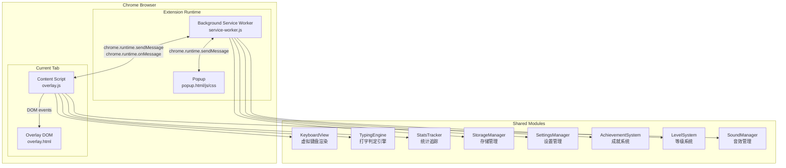
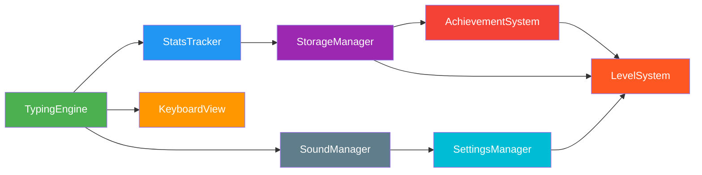
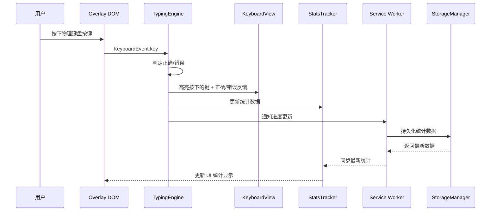
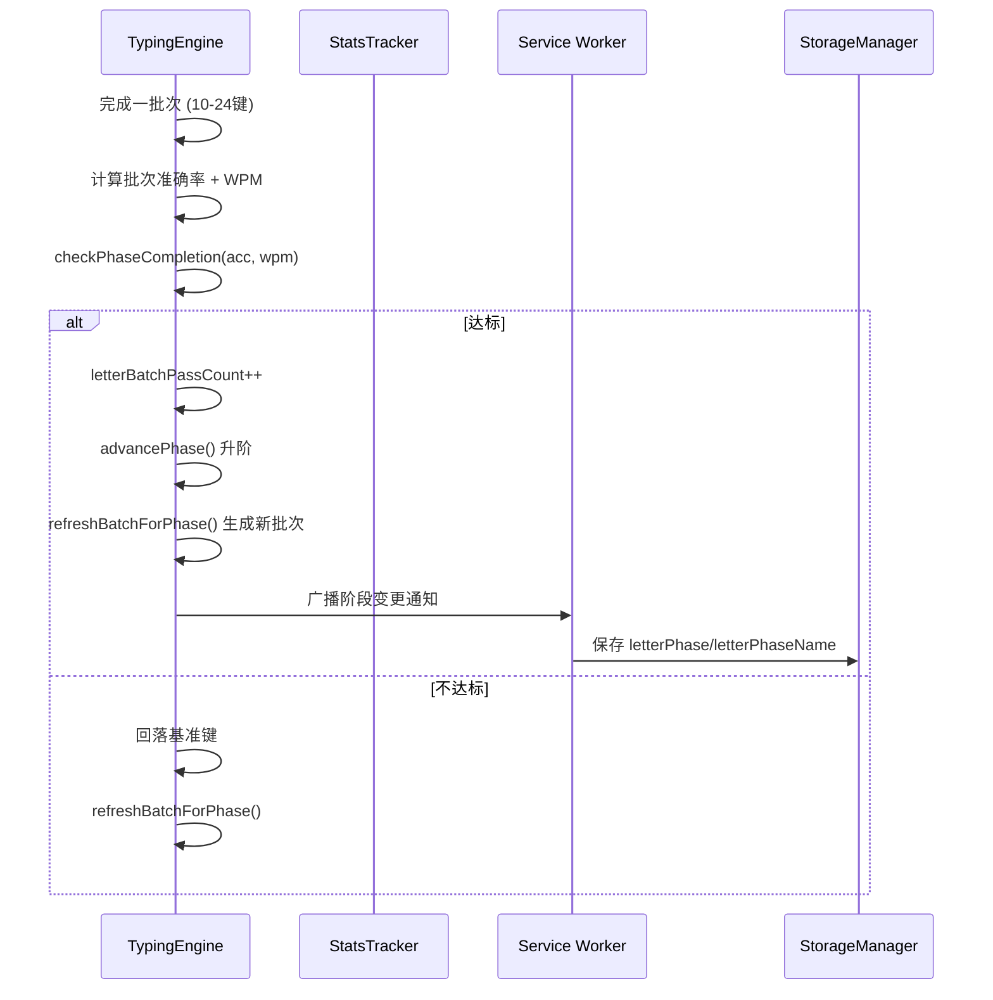
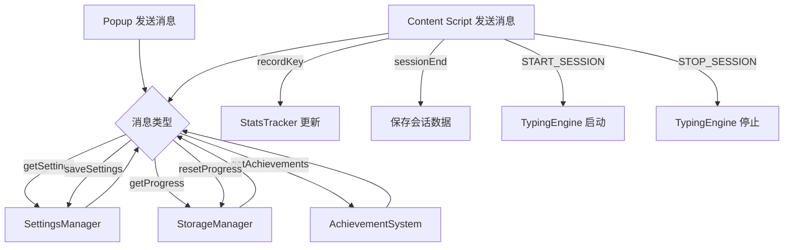
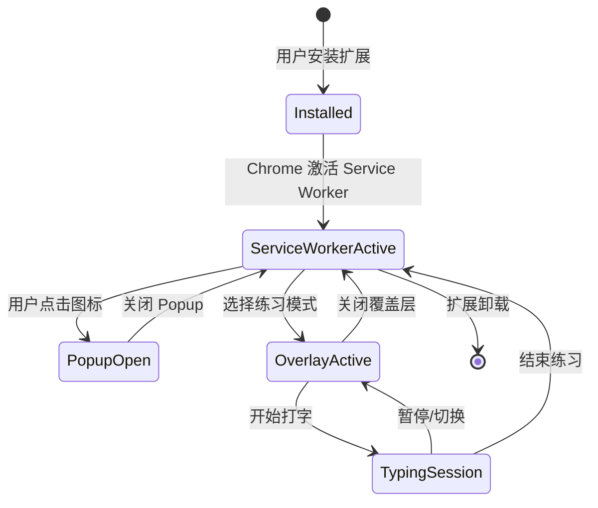

# 系统架构 / System Architecture

## 1. 整体架构

ChildType 是一个 **Chrome Extension Manifest V3** 应用，采用 **Service Worker + Content Script + Popup** 三层架构。



---

## 2. 三个运行时环境

### 2.1 Background Service Worker (`background/service-worker.js`)

| 项目 | 说明 |
|------|------|
| 职责 | 全局状态管理、消息路由、存储读写、后台任务 |
| 生命周期 | 由 Chrome 自动管理（事件驱动，空闲时可能被休眠） |
| 持久化 | 使用 `chrome.storage.local` 保存用户数据（高频写入避免 sync 配额） |
| 权限 | `storage`, `activeTab`, `scripting` |

**关键职责：**
- 接收来自 Popup 和 Content Script 的消息
- 路由到对应的模块处理
- 管理用户设置（`settings` storage key）
- 管理用户进度（`progress` storage key）
- 管理成就数据（`achievements` storage key）
- 在 Content Script 启动/停止时注入/卸载 overlay

### 2.2 Popup (`popup/`)

| 项目 | 说明 |
|------|------|
| 职责 | 用户主界面 — 模式选择、设置、进度概览 |
| 触发方式 | 用户点击浏览器工具栏图标 |
| 尺寸限制 | 25×25 ~ 800×600 px |

**界面分区：**
```
┌─────────────────────────┐
│  [ChildType Logo]       │
├─────────────────────────┤
│  模式选择               │
│  [字母][顺序][自由][指法] │
├─────────────────────────┤
│  快速统计               │
│  WPM: 35  准确率: 92%   │
│  连续正确: 12            │
├─────────────────────────┤
│  进度                   │
│  Lv.3 打字学徒 ██████░░  │
├─────────────────────────┤
│  [设置] [成就]          │
└─────────────────────────┘
```

### 2.3 Content Script + Overlay (`overlay/`)

| 项目 | 说明 |
|------|------|
| 职责 | 注入到当前网页，提供全屏打字练习覆盖层 |
| 触发方式 | 用户从 Popup 选择模式，或通过快捷键触发 |
| 工作方式 | 在页面上覆盖一个半透明层，捕获键盘事件 |

**Overlay 结构：**
```
┌──────────────────────────────────┐
│  模式: 字母练习     WPM: 35  ✅92% │
│  阶段: 3/8 · 单指列               │
├──────────────────────────────────┤
│                                  │
│        按  下  面  的  键          │
│                                  │
│        [目标字母高亮显示]          │
│                                  │
│  ┌──┐┌──┐┌──┐┌──┐┌──┐┌──┐      │
│  │Q ││W ││E ││R ││T ││Y │ ...   │  ← 虚拟键盘
│  └──┘└──┘└──┘└──┘└──┘└──┘      │
│  ┌──┐┌──┐┌──┐┌──┐┌──┐┌──┐      │
│  │A ││S ││D ││F ││G ││H │ ...   │
│  └──┘└──┘└──┘└──┘└──┘└──┘      │
│  ┌──┐┌──┐┌──┐┌──┐┌──┐┌──┐      │
│  │Z ││X ││C ││V ││B ││N │ ...   │
│  └──┘└──┘└──┘└──┘└──┘└──┘      │
│                                  │
│  [暂停] [关闭]                    │
└──────────────────────────────────┘
```

---

## 3. 模块架构

### 3.1 模块清单

| 模块 | 文件 | 职责 | 运行环境 |
|------|------|------|----------|
| `KeyboardView` | `modules/KeyboardView.js` | 渲染虚拟键盘，处理按键视觉反馈 | Content Script |
| `TypingEngine` | `overlay/overlay.js` (内联) | 打字判定、计时、WPM/准确率计算、8阶段进阶逻辑 | Content Script |
| `StatsTracker` | `overlay/overlay.js` (内联) | 收集练习统计数据，生成报告 | Content Script |
| `StorageManager` | `modules/StorageManager.js` | 封装 `chrome.storage.local` 读写 | Service Worker |
| `SettingsManager` | `modules/SettingsManager.js` | 管理用户偏好设置（布局、字体、主题、音效） | Service Worker |
| `AchievementSystem` | `modules/AchievementSystem.js` | 成就定义、解锁判定、徽章展示 | Service Worker |
| `LevelSystem` | `modules/LevelSystem.js` | 等级定义、升级条件、经验计算 | Service Worker |
| `SoundManager` | `modules/SoundManager.js` | Web Audio API 合成打字音效 | Content Script |

### 3.2 模块依赖关系



**依赖说明：**
- `TypingEngine` 是核心引擎，依赖 `KeyboardView`（获取键位信息）、`StatsTracker`（收集统计）、`SoundManager`（播放音效）
- `StatsTracker` 依赖 `StorageManager` 保存统计数据
- `StorageManager` 是所有持久化数据的入口，`AchievementSystem` 和 `LevelSystem` 都依赖它
- `SettingsManager` 管理用户偏好，`LevelSystem` 根据经验计算等级
- `SoundManager` 依赖 `SettingsManager` 判断是否开启音效

---

## 4. 数据流

### 4.1 打字事件流



### 4.2 批次结算与阶段进阶流



### 4.3 消息路由



**消息协议（chrome.runtime.sendMessage）：**

| 方向 | action | payload | 响应 |
|------|--------|---------|------|
| Popup → SW | `getSettings` | `{}` | `{settings}` |
| Popup → SW | `saveSettings` | `{settings}` | `{success}` |
| Popup → SW | `getProgress` | `{}` | `{progress}` |
| Popup → SW | `getAchievements` | `{}` | `{achievements}` |
| Popup → SW | `resetProgress` | `{}` | `{success}` |
| SW → CS | `START_SESSION` | `{mode}` | `{started}` |
| SW → CS | `STOP_SESSION` | `{}` | `{stopped}` |
| CS → SW | `recordKey` | `{key, finger, correct, responseMs}` | `{success}` |
| CS → SW | `sessionEnd` | `{duration, totalKeystrokes, errors, mode, streak, maxStreak}` | `{saved}` |
| CS → SW | `levelUp` | `{newLevel}` | `{ack}` |
| CS → SW | `lettersBatchStarted` | `{batchAccuracy, batchWpm, ...}` | `{ack}` |

---

## 5. 存储架构

### 5.1 Storage Keys

使用 `chrome.storage.local` 进行数据持久化（避免 `chrome.storage.sync` 的每分钟写入配额限制），所有数据在根目录按主题 key 组织：

```json
{
  "settings": {
    "keyboardLayout": "QWERTY",
    "fontSize": 16,
    "theme": "light",
    "soundEnabled": true,
    "defaultMode": "letters"
  },
  "progress": {
    "currentLevel": 3,
    "experience": 450,
    "totalPracticeMinutes": 120,
    "bestWPM": 55,
    "totalKeystrokes": 15000,
    "modeStats": {
      "letters": { "sessions": 10, "bestWPM": 45, "accuracy": 94, "totalMinutes": 0 },
      "ordered": { "sessions": 5, "bestWPM": 40, "accuracy": 96, "totalMinutes": 0 },
      "free": { "sessions": 3, "bestWPM": 30, "accuracy": 90, "totalMinutes": 0 },
      "finger": { "sessions": 2, "bestWPM": 25, "accuracy": 88, "totalMinutes": 0 }
    },
    "modesPlayed": ["letters", "ordered"],
    "lastPracticeDate": "2026-09-10",
    "consecutiveDays": 3,
    "dailyHistory": [
      { "date": "2026-09-10", "minutes": 15, "avgWPM": 35, "accuracy": 92 }
    ],
    "fingerPhase": 0,
    "liveStats": {},
    "fingerStats": { ... },
    "keyProficiency": { ... },
    "letterPhase": 2,
    "letterPhaseName": "单指列"
  },
  "achievements": {
    "unlocked": [
      { "id": "first_key", "unlockedAt": "2026-09-01T10:30:00Z" },
      { "id": "streak_10", "unlockedAt": "2026-09-02T14:20:00Z" }
    ],
    "locked": ["streak_50", "wpm_60", "level_10", "phase_4"]
  }
}
```

### 5.2 Storage Manager 封装

`StorageManager` 提供统一的读写接口，避免直接在业务代码中调用 `chrome.storage` API：

```javascript
// StorageManager 公共接口
const store = new StorageManager();
await store.get('settings');     // 读取 settings key
await store.set('settings', {...}); // 写入 settings key
await store.get('progress.dailyHistory'); // 读取嵌套路径
await store.set('progress.dailyHistory', [...]); // 写入嵌套路径
await store.clear();            // 清除所有数据
```

---

## 6. 字母练习 8 阶段系统

### 6.1 阶段定义

| 阶段 | 名称 | 键位范围 | 组合规则 | 批次大小 | 准确率要求 | WPM 要求 |
|------|------|---------|---------|---------|-----------|---------|
| 0 | 基准键 | asdfjk; | same | 10 | 85% | 12 |
| 1 | 同指相邻 | asdfjk;qwertyuiop | adjacent | 12 | 85% | 14 |
| 2 | 单指列 | asdfjk;qwertyuiopzxcvbnm | columns | 14 | 85% | 16 |
| 3 | 跨指相邻 | asdfjk;qwertyuiopzxcvbnm | cross | 16 | 85% | 18 |
| 4 | 双指配对·入门数字 | abcdefghijklmnopqrstuvwxyz1234 | pairs | 16 | 85% | 20 |
| 5 | 随机字母·进阶数字 | abcdefghijklmnopqrstuvwxyz1234567890 | random | 16 | 85% | 22 |
| 6 | 字母数字·常用符号 | abcdefghijklmnopqrstuvwxyz1234567890-=[]\;:' | random | 20 | 88% | 25 |
| 7 | 全键盘 | abcdefghijklmnopqrstuvwxyz1234567890-=[]\;:'.,/\` | random | 24 | 88% | 28 |

### 6.2 进阶规则

- **每批次必结算**：完成一批次后立即计算准确率和 WPM
- **达标条件**：准确率 ≥ 阈值（前6阶段 85%，后2阶段 88%）AND WPM ≥ 阶段阈值
- **达标结果**：`letterBatchPassCount++`，达标一次即升入下一阶段（minBatches=1）
- **不达标结果**：若当前阶段 > 0，直接回落到 Phase 0（基准键），清零通过计数
- **满级**：Phase 7 完成后提示「所有阶段已完成」

---

## 7. 主题与样式系统

### 7.1 CSS 变量设计

使用 CSS Custom Properties 实现亮/暗/护眼主题切换：

```css
/* 亮色主题（默认） */
:root,
:root[data-theme="light"] {
  --bg-primary: #FFFFFF;
  --bg-secondary: #F5F5F5;
  --text-primary: #333333;
  --text-secondary: #666666;
  --accent: #6C5CE7;
  --key-default: #E0E0E0;
  --key-home: #A29BFE;
  --key-left-pinky: #FF7675;
  --key-left-ring: #FD79A8;
  --key-left-middle: #FDCB6E;
  --key-left-index: #55E6C1;
  --key-right-index: #55E6C1;
  --key-right-middle: #FDCB6E;
  --key-right-ring: #FD79A8;
  --key-right-pinky: #FF7675;
  --key-active: #6C5CE7;
  --key-correct: #00B894;
  --key-wrong: #D63031;
}

/* 暗色主题 */
:root[data-theme="dark"] {
  --bg-primary: #1E1E2E;
  --bg-secondary: #2D2D3D;
  --text-primary: #E0E0E0;
  --text-secondary: #A0A0A0;
  /* ... 其他变量相应调整 */
}

/* 护眼主题 */
:root[data-theme="eye"] {
  --bg-primary: #E8F5E9;
  --bg-secondary: #C8E6C9;
  --text-primary: #2E7D32;
  --text-secondary: #4CAF50;
  /* ... 其他变量相应调整 */
}
```

### 7.2 主题切换机制

```
SettingsManager.getSetting('theme')
  → 读取存储中的 theme 值
  → 设置 document.documentElement.dataset.theme
  → CSS 变量自动切换
  → overlay 和 popup 同步更新
```

---

## 8. 扩展生命周期



**Service Worker 休眠与唤醒：**
- Service Worker 在空闲约 30 秒后可能被 Chrome 休眠
- 收到消息（`chrome.runtime.onMessage`）、定时闹钟（`chrome.alarms`）或用户交互时会重新唤醒
- `StorageManager` 在 Service Worker 中被实例化，确保数据一致性

---

## 9. 安全与权限

### 9.1 权限清单

| 权限 | 用途 | 必要性 |
|------|------|--------|
| `storage` | 保存用户设置和进度 | 核心功能 |
| `activeTab` | 获取当前活跃 Tab ID 以注入脚本 | 核心功能 |
| `scripting` | 动态注入 content script | 核心功能 |
| `<all_urls>` (host) | 使 overlay 可在任意网页上工作 | 核心功能 |

### 9.2 Content Security Policy

```
default-src 'self';
script-src 'self' 'unsafe-inline';
style-src 'self' 'unsafe-inline';
img-src 'self' data:;
font-src 'self';
```

- 不允许外部脚本执行
- 允许内联样式（用于动态主题切换）
- 允许内联脚本（popup/overlay 页面）
- 不允许外部资源加载

---

*文档版本: 2.0.0 | 最后更新: 2026-09-11*