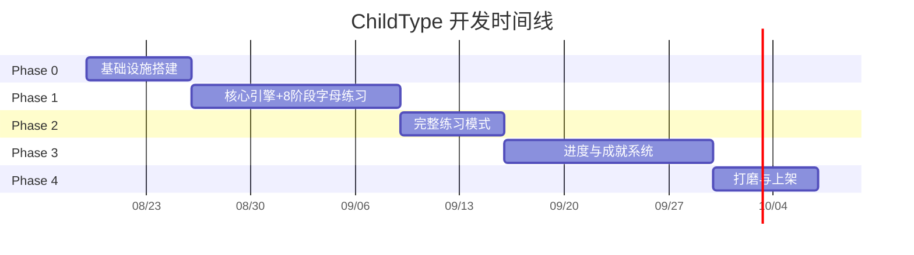

# 开发计划 / Development Plan

本文档定义 ChildType 的分阶段开发计划，包含阶段划分、任务清单、依赖关系和验收标准。

---

## 阶段总览

| 阶段 | 周期 | 目标 | 交付物 |
|------|------|------|--------|
| Phase 0 — 基础设施 | 第 1 周 | 搭建项目骨架、Manifest、基础目录 | 可加载的空壳扩展 |
| Phase 1 — 核心打字引擎 | 第 2–3 周 | 虚拟键盘 + 打字判定 + 字母练习 8 阶段 | 可实际使用的字母练习 |
| Phase 2 — 完整练习模式 | 第 4 周 | 顺序字母/自由打字/指法专项 | 全部 P0 模式完成 |
| Phase 3 — 进度与成就 | 第 5–6 周 | 等级系统、成就系统、存储 | P0 + P1 核心功能 |
| Phase 4 — 打磨与上架 | 第 7 周 | UI 优化、图标、隐私政策、商店材料 | 可提交审核的版本 |

---

## Phase 0 — 基础设施搭建（第 1 周）

### 目标
建立项目骨架，确保扩展可在 Chrome 中加载运行。

### 任务清单

| # | 任务 | 预估时间 | 依赖 | 交付物 |
|---|------|----------|------|--------|
| 0.1 | 创建 `manifest.json`（MV3） | 1h | 无 | manifest.json |
| 0.2 | 创建目录结构（popup/, overlay/, background/, modules/, data/, icons/） | 1h | 无 | 完整目录树 |
| 0.3 | 创建 `background/service-worker.js` 骨架 | 2h | 0.1 | 可运行的 Service Worker |
| 0.4 | 创建 `popup/popup.html` 骨架 | 2h | 无 | 弹出窗口页面 |
| 0.5 | 创建 `popup/popup.css` 骨架 | 2h | 0.4 | 基础样式 |
| 0.6 | 创建 `popup/popup.js` 骨架 | 2h | 0.3 | 消息通信基础 |
| 0.7 | 创建 `overlay/overlay.html` 骨架 | 2h | 无 | 覆盖层页面 |
| 0.8 | 创建 `overlay/overlay.css` 骨架 | 2h | 0.7 | 覆盖层样式 |
| 0.9 | 创建 `overlay/overlay.js` 骨架 | 2h | 0.3 | Content Script 注入基础 |
| 0.10 | 创建 `.gitignore` | 30min | 无 | gitignore 文件 |
| 0.11 | 创建 `privacy-policy.html` | 2h | 无 | 隐私政策页面 |

### 验收标准

- [ ] `chrome://extensions` 可加载项目目录
- [ ] 点击图标可打开 popup 窗口（即使内容为空）
- [ ] Service Worker 控制台无报错
- [ ] 消息通信机制正常（Popup ↔ Service Worker ↔ Content Script）
- [ ] Git 仓库正常，`.gitignore` 排除 node_modules 等

---

## Phase 1 — 核心打字引擎 + 8 阶段字母练习（第 2–3 周）

### 目标
实现虚拟键盘渲染、字母练习 8 阶段进阶系统、打字判定和统计，完成最基本的打字练习功能。

### 任务清单

| # | 任务 | 预估时间 | 依赖 | 交付物 |
|---|------|----------|------|--------|
| 1.1 | 实现 `modules/StorageManager.js` (chrome.storage.local) | 3h | 0.3 | 存储管理器 |
| 1.2 | 实现 `modules/SettingsManager.js` (无难度设置) | 2h | 1.1 | 设置管理器 |
| 1.3 | 实现 `modules/KeyboardView.js` | 6h | 0.8 | 虚拟键盘渲染 |
| 1.4 | 实现 `overlay/overlay.js` 核心引擎 | 8h | 0.9 | 打字判定引擎+阶段进阶 |
| 1.5 | 实现 `data/letter-phases.js` (8阶段定义) | 2h | 无 | 阶段数据 |
| 1.6 | 实现 `modules/StatsTracker.js` (内联到 overlay) | 3h | 1.4 | 统计追踪 |
| 1.7 | 实现 `modules/SoundManager.js` | 2h | 1.1 | 音效管理 |
| 1.8 | 实现字母练习 8 阶段（基准键→全键盘） | 6h | 1.3, 1.4, 1.5 | 完整阶段进阶 |
| 1.9 | 实现 WPM 计算（从第 5 个有效按键起算） | 2h | 1.4 | WPM 实时显示 |
| 1.10 | 实现准确率统计 | 1h | 1.4 | 准确率实时显示 |
| 1.11 | 实现连击计数 | 1h | 1.4 | 连击数显示 |
| 1.12 | 实现按键视觉反馈（正确绿/错误红） | 2h | 1.3 | 按键动画 |
| 1.13 | 实现目标键高亮提示 | 1h | 1.3 | 下一个键提示 |
| 1.14 | 实现 overlay 的启动/停止/暂停 | 2h | 1.8 | 覆盖层控制 |
| 1.15 | 实现 popup 中的模式选择按钮 | 2h | 0.6 | popup 交互 |
| 1.16 | 实现批次结算与阶段判定逻辑 | 4h | 1.4, 1.5 | 进阶/回落机制 |
| 1.17 | 实现数字/符号跨阶段逐步引入 | 3h | 1.5 | 渐进式键位扩展 |

### 验收标准

- [ ] 打开扩展弹出窗口
- [ ] 点击「字母练习」按钮，overlay 在页面上正确显示
- [ ] 虚拟键盘渲染完整 QWERTY 布局，按手指区域用不同颜色标记
- [ ] 按下物理键盘，虚拟键盘对应键有按压动画
- [ ] 正确按键显示绿色反馈，错误显示红色闪烁
- [ ] 顶部实时显示 WPM、准确率、连击数、练习时长
- [ ] **阶段标签显示：如 "阶段 3/8 · 单指列"**
- [ ] **无难度选择器（简单/普通/困难已移除）**
- [ ] 完成一批次（10-24键）后自动判定：达标升阶，不达标回落基准键
- [ ] 数字分两阶段引入（Phase 4: 1234，Phase 5: 567890）
- [ ] 符号分两阶段引入（Phase 6: 常用符号，Phase 7: 其余符号）
- [ ] WPM 阈值平滑：12→14→16→18→20→22→25→28
- [ ] 按 Escape 可关闭 overlay
- [ ] popup 中显示上次练习的快速统计
- [ ] Service Worker 控制台无报错

---

## Phase 2 — 完整练习模式（第 4 周）

### 目标
实现剩余 P0 练习模式：顺序字母、自由打字、指法专项练习。

### 任务清单

| # | 任务 | 预估时间 | 依赖 | 交付物 |
|---|------|----------|------|--------|
| 2.1 | 实现顺序字母模式（A→Z） | 3h | 1.4 | 顺序模式 |
| 2.2 | 实现自由打字模式 | 4h | 1.14 | 自由打字 |
| 2.3 | 实现指法专项练习（8 个手指分区） | 5h | 1.3, 1.4 | 指法练习模式 |
| 2.4 | 实现会话结束数据统计与保存 | 2h | 1.6, 1.1 | 会话持久化 |
| 2.5 | 实现每日挑战基础逻辑 | 3h | 2.4 | 每日挑战 |
| 2.6 | 清理单词/句子模式相关代码和数据文件 | 2h | - | 精简代码库 |

### 验收标准

- [ ] 字母练习模式完整（8 阶段进阶，批次结算自动判定）
- [ ] 顺序字母模式：A→Z 顺序练习，26 字母一轮结束显示统计
- [ ] 自由打字模式：在任何网页上启动，不阻挡原页面，半透明覆盖
- [ ] 指法专项：选择手指 → 仅该手指按键高亮 → 练习统计
- [ ] 所有模式支持暂停/恢复/切换
- [ ] 所有模式支持快捷键（Esc 关闭, Ctrl+Shift+H 暂停）
- [ ] 会话数据正确保存到 chrome.storage.local
- [ ] **已移除：单词/句子模式按钮、数据文件、难度选择器**

---

## Phase 3 — 进度与成就系统（第 5–6 周）

### 目标
实现等级（25级）、成就（48个）、进度追踪系统，提升用户粘性。

### 任务清单

| # | 任务 | 预估时间 | 依赖 | 交付物 |
|---|------|----------|------|--------|
| 3.1 | 实现 `modules/LevelSystem.js` (25级) | 4h | 1.1 | 等级系统 |
| 3.2 | 创建 `data/levels.js`（25 级定义） | 2h | 无 | 等级数据 |
| 3.3 | 实现 `modules/AchievementSystem.js` | 4h | 1.1 | 成就系统 |
| 3.4 | 创建 `data/achievements.js`（48 成就） | 3h | 无 | 成就数据 |
| 3.5 | 实现等级经验累积与升级判定 | 3h | 3.1 | 升级逻辑 |
| 3.6 | 实现 popup 中的等级进度条 | 2h | 3.5 | 进度 UI |
| 3.7 | 实现成就解锁动画和通知 | 3h | 3.3 | 成就 UI |
| 3.8 | 实现每日/每周统计图表（popup 内） | 4h | 2.4 | 统计图表 |
| 3.9 | 实现主题切换（亮色/暗色/护眼） | 2h | 1.2 | 主题切换 |
| 3.10 | 实现字体大小调节 | 2h | 1.2 | 字体设置 |
| 3.11 | 实现快捷键自定义（可选） | 3h | 1.2 | 快捷键设置 |
| 3.12 | 实现每日挑战完整逻辑 | 3h | 3.5 | 每日挑战 |

### 验收标准

- [ ] 等级系统：Lv.1–Lv.25，经验累积，升级动画
- [ ] 成就系统：48 个成就，解锁条件覆盖各类里程碑（阶段完成成就包含在内）
- [ ] popup 显示当前等级、经验条、下一级所需经验
- [ ] 成就墙展示：已解锁彩色，未解锁灰色轮廓
- [ ] 解锁成就时播放动画和音效
- [ ] 每日统计：日期、练习时长、平均 WPM、准确率
- [ ] 每周汇总：趋势图表
- [ ] 主题切换即时生效，跨 popup 和 overlay
- [ ] 字体大小调节即时生效
- [ ] 设置持久化，重启后恢复

---

## Phase 4 — 打磨与上架（第 7 周）

### 目标
完善 UI/UX，准备上架材料，提交 Chrome Web Store 审核。

### 任务清单

| # | 任务 | 预估时间 | 依赖 | 交付物 |
|---|------|----------|------|--------|
| 4.1 | 设计并制作图标（16/48/128px PNG） | 4h | 无 | icons/ 目录 |
| 4.2 | 完善 popup UI（大按钮、儿童友好字体） | 4h | 3.6 | 精美 popup |
| 4.3 | 完善 overlay UI（动画、过渡效果、阶段徽章） | 4h | 1.8 | 精美 overlay |
| 4.4 | 优化 CSS 变量主题系统（3主题） | 2h | 3.9 | 主题完成 |
| 4.5 | 完善隐私政策页面（声明 local storage） | 2h | 0.11 | 合规隐私政策 |
| 4.6 | 准备应用截图（4-8 张） | 4h | 4.2, 4.3 | 截图文件 |
| 4.7 | 编写商店描述（中英文） | 2h | 无 | 描述文本 |
| 4.8 | 注册 Chrome Web Store 开发者账号 | 1h | 无 | 账号 |
| 4.9 | ZIP 打包并提交审核 | 2h | 4.6–4.8 | 提交审核 |
| 4.10 | 修复审核反馈（如有） | 视情况 | 4.9 | 通过审核 |

### 验收标准

- [ ] 图标在 16px/48px/128px 下清晰可辨
- [ ] popup UI 儿童友好（大按钮、明亮色彩、清晰字体）
- [ ] overlay 动画流畅（按键反馈、过渡效果、阶段升级动画）
- [ ] 主题切换在 popup 和 overlay 中均正常（亮/暗/护眼）
- [ ] 隐私政策页面内容完整、合规（声明 chrome.storage.local）
- [ ] 商店描述清晰、准确、在 132 字符限制内
- [ ] ZIP 打包正确（manifest.json 在根目录）
- [ ] 通过 Chrome Web Store 审核

---

## 开发节奏建议

---

## 风险控制

| 风险 | 影响 | 缓解措施 |
|------|------|----------|
| Service Worker 被 Chrome 休眠 | 消息中断，状态丢失 | 所有状态通过 StorageManager 持久化到 local storage |
| chrome.storage.sync 写入频率限制 | 高频保存失败 | **已迁移至 chrome.storage.local，无每分钟配额限制** |
| 8 阶段难度曲线过陡 | 用户挫败感强 | 数字/符号跨多阶段逐步引入，WPM 阈值平滑 +2 递进 |
| Chrome 审核不通过 | 延迟上架 | 提前对照政策文档检查，确保隐私政策合规（声明 local storage） |
| 图标设计不符合规范 | 审核驳回 | 参照 Chrome Web Store 图标规范，提供多尺寸 |

---

## 变更记录

| 版本 | 日期 | 变更内容 |
|------|------|----------|
| 2.0.0 | 2026-09-11 | 移除单词/句子模式；移除手动难度选择；字母练习重设为 8 阶段进阶；数字符号渐进引入；存储迁移至 local |
| 1.0.0 | 2026-08-19 | 初始版本 |

---

*文档版本: 2.0.0 | 最后更新: 2026-09-11*