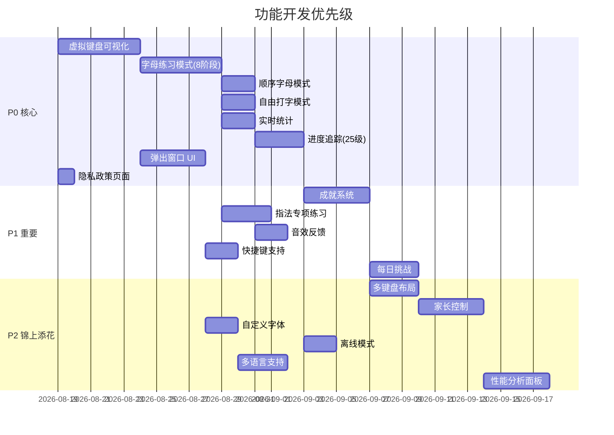

# 功能清单 / Feature List

本文档按优先级（P0/P1/P2）列出 ChildType 的所有功能，每个功能包含描述、用户故事、验收标准。

---

## 优先级 P0 — 核心功能（必须有）

这些功能是扩展上线的最低要求，缺少任何一项都无法通过 Chrome Web Store 审核。

### F001: 虚拟键盘可视化

| 项目 | 内容 |
|------|------|
| **用户故事** | 作为小朋友，我想看到彩色的键盘，知道每个键用哪个手指按 |
| **描述** | 在 overlay 中渲染完整的 QWERTY 键盘，每个键按手指区域用不同颜色标记 |
| **验收标准** | 1. 显示标准 104 键键盘布局（主键区 3 行字母+数字+功能键） 2. 左/右手按键用不同底色区分 3. 每个手指（拇指除外）对应一组键，用特定颜色标注 4. 按下物理键盘时，虚拟键盘对应键有按压动画 5. 按键正确显示绿色反馈，错误显示红色闪烁 6. 下一个目标键用边框高亮提示 |

### F002: 字母练习模式（8 阶段进阶）

| 项目 | 内容 |
|------|------|
| **用户故事** | 作为初学者，我想按阶段逐步学习全键盘，每完成一组就升阶 |
| **描述** | 8 个阶段从基准键到全键盘，数字和符号跨多阶段逐步引入。每批次完成后自动判定：达标升阶，不达标回落基准键。难度完全自动化，无需用户手动选择。 |
| **验收标准** | 1. 8 个阶段：基准键 → 同指相邻 → 单指列 → 跨指相邻 → 双指配对·入门数字 → 随机字母·进阶数字 → 字母数字·常用符号 → 全键盘 2. 数字分两阶段引入：Phase 4 引入 1234，Phase 5 引入 567890 3. 符号分两阶段引入：Phase 6 引入常用符号 `-=[]\;:'`，Phase 7 补全 `.,/\`` 4. 每批次（10-24 键）完成后自动判定：准确率≥85% 且 WPM≥阈值 → 升阶；否则回落基准键 5. WPM 阈值平滑递进：12→14→16→18→20→22→25→28 6. 难度完全自动化，UI 中不显示简单/普通/困难选项 |

### F003: 顺序字母模式

| 项目 | 内容 |
|------|------|
| **用户故事** | 作为初学者，我想按 A→Z 顺序练习字母，建立键位顺序记忆 |
| **描述** | 顺序显示 26 个字母，用户按顺序按下对应键 |
| **验收标准** | 1. 目标字母按 A-Z 顺序显示 2. 正确按键后自动切换到下一个字母 3. 完成 26 字母后显示本轮统计并结束 |

### F004: 自由打字模式

| 项目 | 内容 |
|------|------|
| **用户故事** | 作为用户，我想在任何网页上直接开始打字练习，不需要选择模式 |
| **描述** | overlay 以最小化模式悬浮在页面上，捕获所有键盘输入进行练习 |
| **验收标准** | 1. 点击 overlay 角落的「自由打字」按钮启动 2. 覆盖层半透明，不阻挡用户查看原网页 3. 键盘视图固定在底部，统计信息固定在顶部 4. 按 Escape 键关闭覆盖层 5. 统计独立于其他模式的练习 |

### F005: 实时统计

| 项目 | 内容 |
|------|------|
| **用户故事** | 作为学习者，我想看到自己的打字速度和准确率 |
| **描述** | 在 overlay 顶部实时显示 WPM、准确率、连击数、练习时长 |
| **验收标准** | 1. WPM（Words Per Minute）从第 5 个有效按键后开始计算 2. 准确率 = 正确按键数 / 总按键数 × 100% 3. 连击数：连续正确按键计数，错误时归零 4. 练习时长从第一次按键开始计时 5. 所有数据实时更新，不延迟 |

### F006: 进度追踪（等级系统 25 级）

| 项目 | 内容 |
|------|------|
| **用户故事** | 作为学习者，我想看到自己的等级和进步 |
| **描述** | 基于练习数据计算等级（Lv.1–Lv.25），在 popup 中展示进度 |
| **验收标准** | 1. 等级经验值随练习时长和正确率累积 2. 每级升级所需经验递增（Lv.1: 100, Lv.2: 250, ... Lv.25: 5000+） 3. popup 中显示当前等级、经验条、下一级所需经验 4. 历史记录按天保存，显示每日练习时长和平均 WPM 5. 数据存储在 `chrome.storage.local` 中（高频写入避免配额限制） |

### F007: 弹出窗口 UI

| 项目 | 内容 |
|------|------|
| **用户故事** | 作为用户，我想点击图标就能快速开始练习或查看设置 |
| **描述** | 点击扩展图标弹出窗口，包含模式选择、快速统计、设置入口 |
| **验收标准** | 1. 窗口尺寸不超过 800×600 px 2. 顶部显示模式选择按钮（字母/自由/顺序/指法） 3. 中部显示最近一次练习的快速统计 4. 底部显示等级进度条 5. 提供「设置」和「成就」入口按钮 6. UI 适配儿童友好的大按钮和清晰字体 |

### F008: 隐私政策页面

| 项目 | 内容 |
|------|------|
| **用户故事** | 作为开发者，我必须提供隐私政策才能上架 Chrome Web Store |
| **描述** | 提供 `privacy-policy.html` 页面，声明数据存储方式 |
| **验收标准** | 1. 页面说明所有数据存储在浏览器本地（chrome.storage.local） 2. 声明不收集、不上传任何用户数据 3. 声明不向第三方分享数据 4. 提供数据导出和清除说明 5. 页面可通过扩展访问 |

---

## 优先级 P1 — 重要功能

这些功能提升用户体验和差异化竞争力。

### F101: 成就系统

| 项目 | 内容 |
|------|------|
| **用户故事** | 作为小朋友，我想获得成就徽章来激励自己继续练习 |
| **描述** | 48 个成就徽章，解锁条件覆盖各种练习里程碑 |
| **验收标准** | 1. 至少包含 48 个成就（首键、连击、WPM 突破、等级里程碑、阶段完成等） 2. 成就图标采用卡通风格，色彩鲜艳 3. popup 中展示成就墙，已解锁显示彩色，未解锁显示灰色轮廓 4. 解锁成就时播放动画和音效 5. 成就数据持久化存储 |

### F102: 指法专项练习

| 项目 | 内容 |
|------|------|
| **用户故事** | 作为初学者，我想只练习某个手指负责的键，加强肌肉记忆 |
| **描述** | 按手指（左小指、左无名指、左中指、左食指、右食指、右中指、右无名指、右小指）分组，单独练习该手指负责的键位 |
| **验收标准** | 1. 提供 8 个手指分区练习选项（不含拇指） 2. 练习时键盘只显示当前手指对应的键（其他键灰色化） 3. 目标字母限制为该手指负责的键 4. 练习完成后统计该手指的准确率和 WPM |

### F103: 音效反馈

| 项目 | 内容 |
|------|------|
| **用户故事** | 作为小朋友，我想听到按键的反馈声音，让练习更有趣 |
| **描述** | 使用 Web Audio API 合成打字音效（正确/错误不同音效） |
| **验收标准** | 1. 默认开启音效 2. 正确按键播放「嗒」声（短促清脆） 3. 错误按键播放低沉「嗡」声 4. 可在设置中关闭音效 5. 音效使用 Web Audio API 合成，不依赖外部文件 |

### F104: 快捷键支持

| 项目 | 内容 |
|------|------|
| **用户故事** | 作为熟练用户，我想用快捷键快速启动覆盖层 |
| **描述** | 注册全局快捷键（如 Ctrl+Shift+T），快速启动/关闭 overlay |
| **验收标准** | 1. 默认快捷键 `Ctrl+Shift+T` 启动 overlay 2. `Escape` 关闭 overlay 3. `Ctrl+Shift+H` 暂停/恢复练习 4. 快捷键可在设置中自定义（P1 后期） 5. 快捷键注册使用 `chrome.commands` API |

### F105: 每日挑战

| 项目 | 内容 |
|------|------|
| **用户故事** | 作为用户，我想每天有新的练习目标 |
| **描述** | 每天生成一个随机挑战（如「5 分钟内达到 WPM 40」），完成后获得额外经验 |
| **验收标准** | 1. 每天更新挑战内容 2. 挑战类型随机：速度挑战、准确率挑战、连续正确挑战 3. 完成挑战获得额外经验加成（1.5×） 4. popup 中显示今日挑战进度 |

---

## 优先级 P2 — 锦上添花

这些功能在核心功能完成后逐步实现。

### F201: 多键盘布局支持

| 项目 | 内容 |
|------|------|
| **描述** | 支持 QWERTY（默认）和 AZERTY 两种键盘布局 |
| **验收标准** | 1. 设置中可选择键盘布局 2. 切换布局后虚拟键盘按键位置自动重排 3. 阶段键位定义按布局适配 |

### F202: 家长控制模式

| 项目 | 内容 |
|------|------|
| **描述** | 家长可设置练习时长限制、查看孩子练习报告 |
| **验收标准** | 1. 可设置每日最大练习时长（如 30 分钟） 2. 超时后 overlay 提示休息 3. 周报告汇总：总时长、平均 WPM、准确率趋势 |

### F203: 自定义字体大小

| 项目 | 内容 |
|------|------|
| **描述** | 用户可调整目标字母和键盘字体大小 |
| **验收标准** | 1. 字体大小范围：12px – 48px 2. 设置中提供滑块调节 3. 设置即时生效，覆盖 popup 和 overlay |

### F204: 离线模式

| 项目 | 内容 |
|------|------|
| **描述** | 扩展完全本地运行，不依赖网络 |
| **验收标准** | 1. 所有功能离线可用 2. 使用 `chrome.storage.local` 本地存储，无同步依赖 3. 恢复在线后数据仍在本地 |

### F205: 多语言支持

| 项目 | 内容 |
|------|------|
| **描述** | 界面支持中文和英文切换 |
| **验收标准** | 1. 使用 `chrome.i18n` API 实现国际化 2. 设置中可切换界面语言 3. 阶段名称支持中英文显示 |

### F206: 性能分析面板

| 项目 | 内容 |
|------|------|
| **描述** | 为家长提供详细的孩子打字能力分析报告 |
| **验收标准** | 1. 按手指分析准确率（哪些手指需要加强） 2. 按时间段分析（上午/下午/晚上效率对比） 3. 趋势图表（WPM 和准确率随时间变化） |

---

## 功能优先级总览

---

## 已移除/已完成的功能

| 原功能 | 状态 | 说明 |
|--------|------|------|
| 单词练习模式 (F003) | ❌ 已移除 | 简化模式，专注字母/指法进阶 |
| 句子练习模式 (F004) | ❌ 已移除 | 简化模式，专注字母/指法进阶 |
| 手动难度选择 | ❌ 已移除 | 难度现由 8 阶段自动内部调节 |
| chrome.storage.sync | ❌ 已替换 | 改用 chrome.storage.local 避免写入配额限制 |

---

*文档版本: 2.0.0 | 最后更新: 2026-09-11*